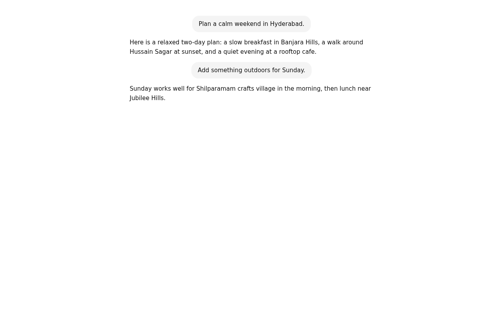
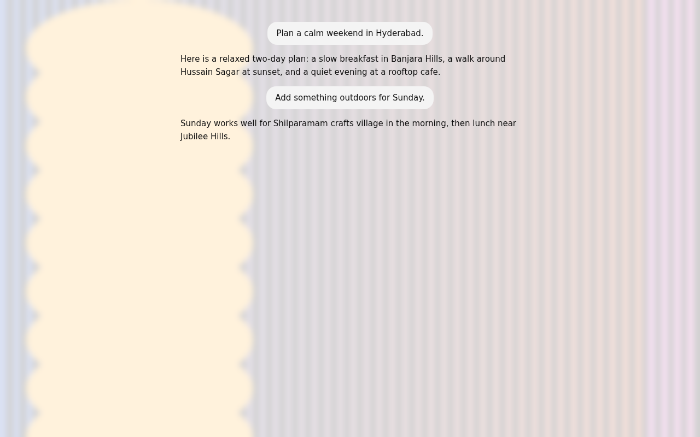

# SkinShift for AI Chats

[](LICENSE)
[](CONTRIBUTING.md)

> **Make your AI chat yours, not OpenAI's white box.**

ChatGPT, Claude and Gemini all look the same: a white box with zero personalization. You can
put a wallpaper behind WhatsApp or Instagram, but not behind the tools many of us use for hours a
day. SkinShift adds a wallpaper, a frosted-glass layer and a readability check to those three
sites. It runs entirely on your machine.




*Screenshots are from a mock ChatGPT-shaped page, not the live site. See [QA checklist](docs/QA_CHECKLIST.md).*

## Features

- **Your wallpaper.** Upload a JPEG, PNG or WebP photo up to 15 MB. It is resized to at most 1920×1080 and re-encoded on your device, which also strips EXIF metadata.
- **Frosted glass.** A blur and tint layer sits behind the chat, not on top of it. Chat text keeps the site's own colours and fonts.
- **Readability check.** A live WCAG AA contrast check in the popup, plus a `!` badge on the toolbar icon when the setup would fail. It warns and never blocks.
- **Three tuned presets.** Light overlay, Dark overlay, High blur. Each passes WCAG AA over pure black and pure white wallpapers in both light and dark mode. The test suite checks this.
- **Performance mode.** Swaps the GPU-heavy blur for a plain tint.
- **Per-site control.** Turn it on or off for ChatGPT, Claude or Gemini independently.
- **Survives the site.** Persists across refreshes and the site's constant re-renders. Follows the site's own dark/light switch with no reload.
- **Fails quietly.** If a site changes its layout, SkinShift does nothing and the popup says "layout not recognised". It never throws on the chat page.

## Supported sites

| Site | Host | Status |
|---|---|---|
| ChatGPT | `chatgpt.com` | Verified live 2026-10-09 (wallpaper + blur, Chrome 154). |
| Claude | `claude.ai` | Verified live 2026-10-09 (wallpaper + blur, Chrome 154). |
| Gemini | `gemini.google.com` | Verified live 2026-10-09 (wallpaper + blur, Chrome 154, no Trusted Types violations). |

Selectors are per site, in `src/content/site-adapters/`. Each file says when it was last verified and which selectors are fragile.

## Install (load unpacked)

Chrome Web Store submission is not yet done. Install from the GitHub release:

1. Download `skinshift-v0.1.0.zip` from the **Releases** page and unzip it.
2. Open `chrome://extensions` and turn on **Developer mode** (top right).
3. Click **Load unpacked** and select the unzipped `skinshift` folder.
4. Pin the SkinShift icon, open ChatGPT, Claude or Gemini, click the icon, and upload a photo.

To update, download the new zip, replace the folder, and click the reload icon on the SkinShift card.

## Privacy

SkinShift makes **zero network requests of its own**. There is no analytics, no telemetry, no remote fonts and no CDN. Everything is bundled. Your wallpaper and settings stay in your browser's local storage on your computer.

You don't have to take this on trust. Verify it:

1. Open DevTools (`F12`) on a supported chat page and go to the **Network** tab.
2. Tick **Preserve log**, then reload the page with SkinShift active.
3. Filter by `chrome-extension://`. You should see no requests.
4. Compare the page's requests with the overlay on and off. Only the site's own requests should appear. SkinShift adds none.
5. In `chrome://extensions`, click **Service worker** under SkinShift and check the Network tab there too.

Full details, including a justification for every permission, are in [docs/PRIVACY.md](docs/PRIVACY.md).

## Known limitations

- **Selectors can break.** These sites redesign often. When they do, SkinShift becomes a no-op on that site. See [CONTRIBUTING.md](CONTRIBUTING.md) to fix an adapter.
- **Live verification is pending for v0.1.0.** The mock suites pass. The real sites have not yet been checked, and the `[M]` items in [QA checklist](docs/QA_CHECKLIST.md) remain open.
- **Readability is judged on the photo's average colour.** A photo with a bright and a dark strip can average to a pass while some words sit on a failing patch. Pick a moderately toned photo, or raise the opacity.
- **Blur does not change the readability verdict.** That is correct on average, but it means the badge does not reflect what a given blur looks like.
- **Chromium-family browsers only.** Chrome is tested in the mock suites. Edge and Brave should work. Firefox and Safari are not supported.
- **No permanence guarantee.** See the disclaimer below.

## Disclaimer

SkinShift is a client-side cosmetic CSS and DOM overlay, conceptually the same as Stylus or Dark Reader. It does not modify, read or transmit your conversations, and it does not intercept API calls. It is **unofficial and unaffiliated** with OpenAI, Anthropic or Google. ChatGPT, Claude and Gemini are the names of their respective owners and are used only to say which sites SkinShift works with. The site owners may change their pages at any time, and SkinShift makes no guarantee that it will keep working. Use it at your own discretion and check the terms of the services you use.

## Contributing

Adding a site is a good first contribution, typically under 10 minutes. See [CONTRIBUTING.md](CONTRIBUTING.md). Architecture notes are in [docs/ARCHITECTURE.md](docs/ARCHITECTURE.md) and design decisions are in [DECISIONS.md](DECISIONS.md).

New here? Bug reports, site requests and pull requests all have templates —
[open an issue](https://github.com/Mounesh-13/skinshift/issues/new/choose) and
pick one. Please follow the [Code of Conduct](CODE_OF_CONDUCT.md), and report
security issues privately per [SECURITY.md](SECURITY.md), never as public issues.

## Development

```bash
npm install
npx playwright install chromium
npm run test          # unit + mock end-to-end suites, real Chromium with the extension loaded
npm run icons         # regenerate icon artwork (Pillow)
npm run package       # build dist/skinshift-v0.1.0.zip
HEADED=1 npm run test:selectors   # live selector check, needs a logged-in profile
```

## License

MIT. See [LICENSE](LICENSE). Icon artwork is original and created for this project.
